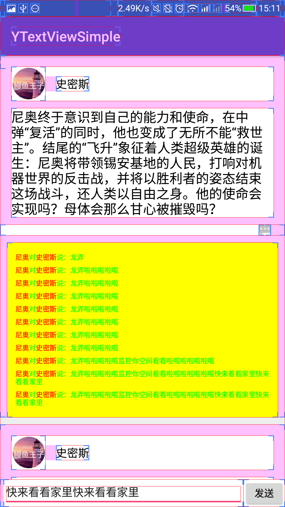

# YTextView
展示多条文本的View,在列表中需要显示所有评论内容时，这个View很合适

#功能和原理
做评论列表的时候，由于不能确定留言的条数，所以View的数量不能确定，就会导致ListView在滑动的时候会出现卡顿。
这里用一个自定义的View来现实所有的评论内容，姐可以解决卡顿的问题

#截图


#用法
构建一个SpannableString
```java
private SpannableString buildSpannableString(final Model.Comment comment){
        String commentItemString = comment.sender + "对"+comment.reciever +"说："+comment.message;
        SpannableString spannableString = new SpannableString(commentItemString);
        spannableString.setSpan(new Clickable(new View.OnClickListener() {
            @Override
            public void onClick(View v) {
                //点击代码
                Toast.makeText(context, "onClick"+comment.sender, Toast.LENGTH_SHORT).show();
            }

        }), 0, comment.sender.length(), Spanned.SPAN_EXCLUSIVE_EXCLUSIVE);
        spannableString.setSpan(
                new ForegroundColorSpan(Color.RED), 0, comment.sender.length(), Spannable.SPAN_EXCLUSIVE_EXCLUSIVE);

        spannableString.setSpan(
                new Clickable(new View.OnClickListener() {
            @Override
            public void onClick(View v) {
                //点击代码
                Toast.makeText(context, "onClick"+comment.reciever, Toast.LENGTH_SHORT).show();
                }

           }), comment.sender.length()+1,  comment.sender.length()+1 + comment.reciever.length(), Spanned.SPAN_EXCLUSIVE_EXCLUSIVE);
        spannableString.setSpan(
                new ForegroundColorSpan(Color.RED), comment.sender.length()+1,  comment.sender.length()+1 + comment.reciever.length(), Spannable.SPAN_EXCLUSIVE_EXCLUSIVE);

        return spannableString;
}
```
设置评论的每一条数据
```java
private void setCommentData(YTextView textView  , Model model){
        ///设置评论数据
        if (model.commentList!=null && model.commentList.size() > 0){
            List<Item> items = new ArrayList<>();
            for (Model.Comment comment: model.commentList) {
                Text.Builder builder = new Text.Builder()
                        .setCharSequence(buildSpannableString(comment)) //评论数据
                        .setOnItemTapListener(new Listener.OnItemTapListener() {//点击事件 
                            @Override
                            public void onItemTapListener(View view, int position) {
                                Toast.makeText(context, "position==="+position, Toast.LENGTH_SHORT).show();
                            }
                        })
                        .setLongPressedListener(new Listener.OnItemLongPressedListener() {//长按事件 
                            @Override
                            public boolean onItemLongPressedListener(View view, int position) {
                                Toast.makeText(context, "long press position==="+position, Toast.LENGTH_SHORT).show();
                                return true;
                            }
                        });
                items.add(builder.builder());
            }
            textView.setTexts(items);
        }else {
            textView.setTexts(Collections.<Item>emptyList());
        }
    }
```
xml配置
```
<com.cyy.ytextview.YTextView
        xmlns:app="http://schemas.android.com/apk/res-auto"
        android:id="@+id/textView"
        android:layout_width="match_parent"
        android:layout_height="wrap_content"
        android:layout_marginLeft="10dp"
        android:layout_marginRight="10dp"
        android:layout_marginTop="10dp"
        android:background="#ffFF00"
        android:paddingTop="20dp"
        android:paddingBottom="40dp"
        android:paddingLeft="10dp"
        android:paddingRight="20dp"
        android:padding="12dp"
        app:y_selectBackground="@drawable/bg_select" 
        app:y_textSize="10sp"
        app:y_itemSpace="5dp"
        app:y_textColor="#00ff00"/>
```
y_selectBackground:点击时高亮的背景
y_textSize：字体大小
y_itemSpace：每一条评论之间的间距
y_textColor：文字颜色
